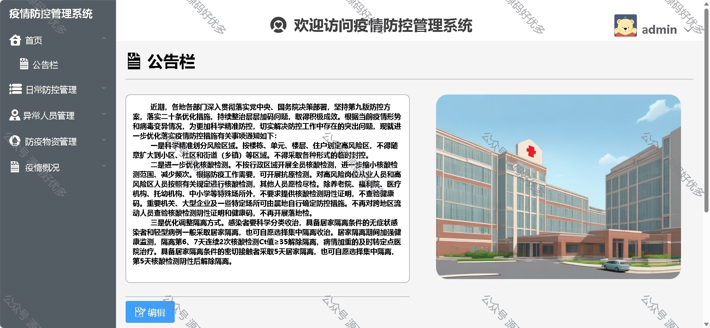
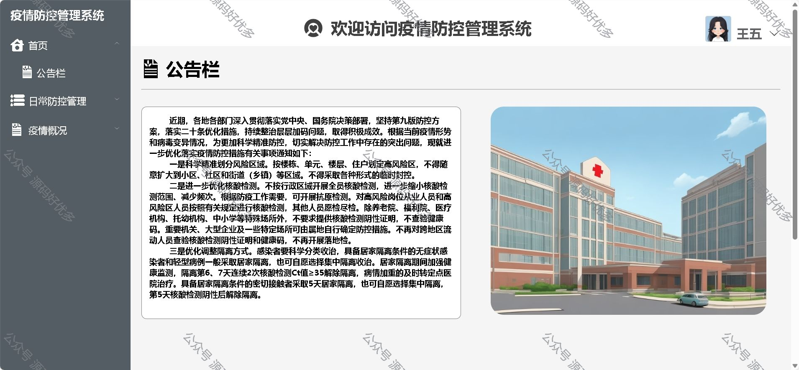
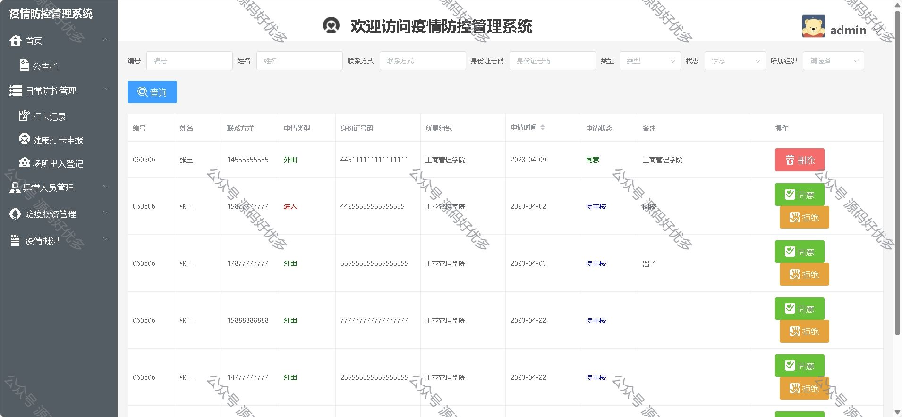
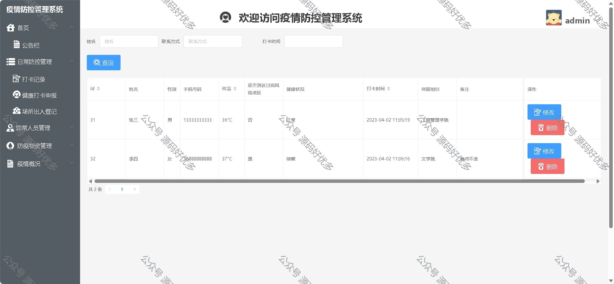
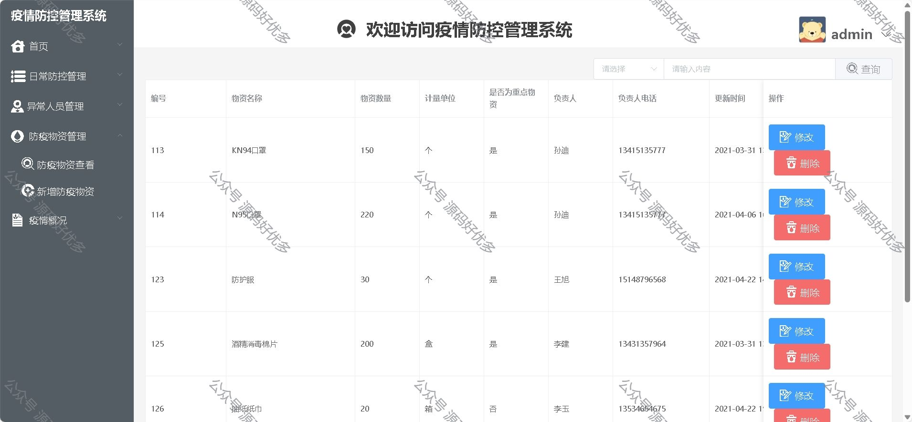
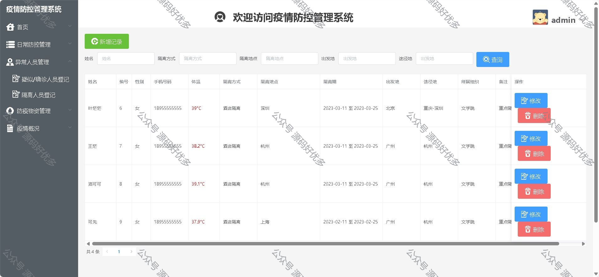
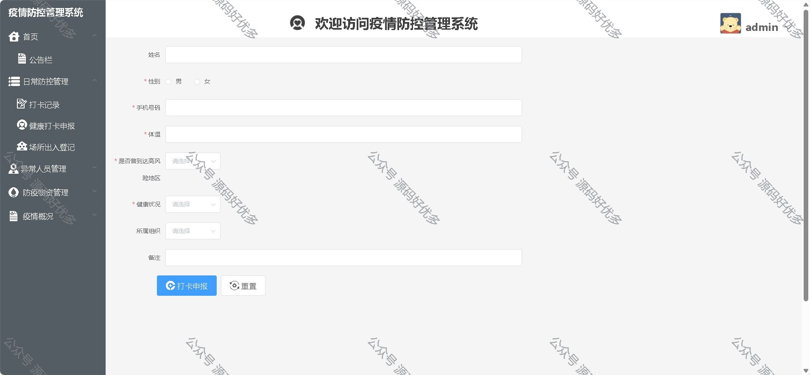
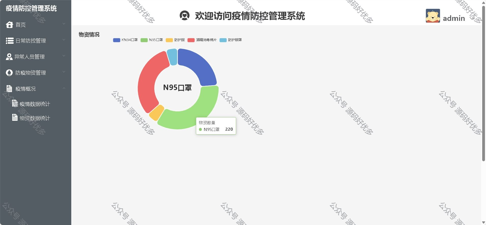
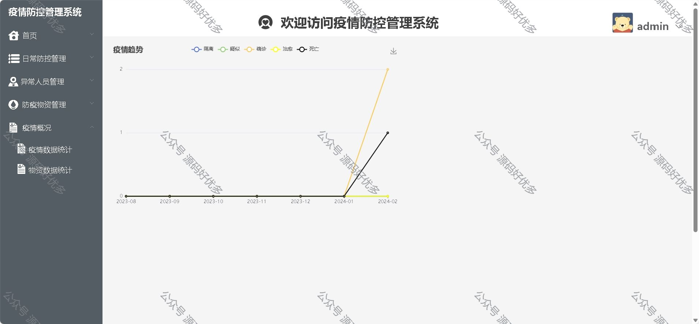

### 一、作品包含

源码+数据库+设计文档+全套环境和工具资源+部署教程

### 二、项目技术

前端技术：Html、Css、Js、Vue、Element-ui

数据库：MySQL

后端技术：Java、Spring Boot、MyBatis

### 三、运行环境

开发工具：IDEA/eclipse

数据库：MySQL8.0

数据库管理工具：Navicat10以上版本

环境配置软件： JDK1.8+Maven3.6.3

前端Nodejs：16

### 四、项目介绍

项目编号：springbootA020

基于Java 的疫情防控管理系统功能：登录、用户注册、管理员、用户、打卡记录、健康打卡申报、场所出入登记、人员登记、疑似病例记录、隔离人员登记、防疫物资查看、疫情数据统计、物资数据统计等

### 五、运行截图

